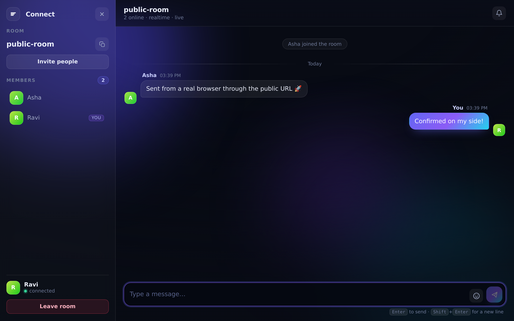

# Deploying Connect — how to *be* the server



_Verified end to end: the screenshot above is two real Chrome instances talking over
`wss://` through a public Cloudflare tunnel to this server, running unmodified._

## The mental model

Connect has no "server mode" to switch on. **One process is the server for every
room.** When you run `node server.js`, you are the server; everyone else is a client
whose entire job is to open a URL and type a room ID.

```
you:      node server.js            ← this process holds all rooms in memory
them:     https://your-address → pick a name + room ID → chat
```

So "deployment" is only ever this question: **how does your friend's browser reach your
machine's port 3000?** Pick whichever row fits you:

| Scenario | Command | Who can join |
| --- | --- | --- |
| Quick demo, no hosting account | `./deploy/tunnel.sh` | Anyone with the public URL |
| Friends on the same WiFi | `node server.js` | Anyone on your network (LAN IP) |
| Always-on, your own domain | VPS + nginx + systemd (§3) | The whole internet |
| No server admin at all | `fly deploy` / Render (§4) | The whole internet |
| Your own infra | `docker compose up -d` (§5) | Whatever you expose |

---

## 1. Your own computer + a public URL (fastest)

`cloudflared` dials *out* from your machine, so there is no port forwarding, no router
config, and no firewall change:

```bash
# install once (macOS: brew install cloudflared · Windows: winget install cloudflared)
curl -L -o cloudflared https://github.com/cloudflare/cloudflared/releases/latest/download/cloudflared-linux-amd64
sudo install cloudflared /usr/local/bin/ && rm cloudflared

./deploy/tunnel.sh
#   → starting Connect on 0.0.0.0:3000
#   → opening public tunnel
#   → https://random-words-here.trycloudflare.com
```

Send that `https://…trycloudflare.com` link to your friends. The app automatically
upgrades to `wss://` and everything works over TLS — no extra configuration.

**Good to know**
- The free quick-tunnel URL is **random and changes every time you restart** it (a named
  tunnel with your own domain is free too, and permanent — see Cloudflare Zero Trust docs).
- Your machine must stay awake and the script must keep running. Close the laptop → the
  room is gone. That's why §3 exists.
- `ngrok http 3000` and `tailscale funnel 3000` are drop-in alternatives.

## 2. Same WiFi only (no internet exposure)

```bash
node server.js
```

Find your LAN address — `hostname -I` (Linux), `ipconfig getifaddr en0` (macOS),
`ipconfig` (Windows) — and share `http://192.168.x.x:3000` (or `http://10.x.x.x:3000`;
the sandbox preview shows the same idea on `172.17.x.x`). If it doesn't load for others,
allow the port through your firewall:

```bash
# Linux, ufw
sudo ufw allow 3000/tcp
# Windows (admin PowerShell)
netsh advfirewall firewall add rule name="Connect" dir=in action=allow protocol=TCP localport=3000
```

## 3. A VPS — the "always on, my own domain" setup

Roughly 5 minutes on a ₹400/month VPS (Hetzner, DigitalOcean, Linode, any provider).

```bash
# on the server
sudo apt update && sudo apt install -y nodejs nginx          # needs Node 18+

sudo adduser --system --group --home /opt/connect connect     # unprivileged user
sudo mkdir -p /opt/connect && cd /opt/connect
# copy server.js, lib/, public/, package.json, deploy/ here (scp, rsync or git clone)
sudo chown -R connect:connect /opt/connect

sudo cp deploy/connect.service /etc/systemd/system/
sudo systemctl daemon-reload && sudo systemctl enable --now connect
systemctl status connect       # should say: active (running)

curl -s localhost:3000/health  # {"ok":true,...}
```

Then put nginx in front for your domain + TLS:

```bash
sudo cp deploy/nginx.conf /etc/nginx/sites-available/connect
sudo sed -i 's/chat.example.com/YOUR.DOMAIN/' /etc/nginx/sites-available/connect
sudo ln -s /etc/nginx/sites-available/connect /etc/nginx/sites-enabled/
sudo nginx -t && sudo systemctl reload nginx

sudo apt install -y certbot python3-certbot-nginx
sudo certbot --nginx -d YOUR.DOMAIN     # free HTTPS; now wss:// works
```

Firewall: open **80 and 443 only**. Port 3000 should stay internal —
`sudo ufw allow 'Nginx Full' && sudo ufw enable`.

The two `Upgrade` / `Connection` lines in `deploy/nginx.conf` are what keep the chat
realtime. Leave them out and Connect still works, but it silently falls back to HTTP
polling (the header will read "basic mode" instead of "realtime · live").

## 4. Managed hosts (nothing to administrate)

**Fly.io** — a `fly.toml` tuned for Connect is included:

```bash
fly launch --no-deploy     # keep the existing fly.toml when prompted
fly deploy                 # → https://your-app.fly.dev
```

`auto_stop_machines = false` and `min_machines_running = 1` matter: a suspended machine
would drop every socket and wipe room state, because rooms live in memory.

**Render** — commit the repo, then "New → Blueprint" and point it at `render.yaml`
(sets the free plan, the `/health` check, and `node server.js`).

**Railway / Koyeb / any PaaS** — deploy the repo as a Node service, start command
`node server.js`. They set `PORT` for you; the app reads it automatically.

## 5. Docker, anywhere

```bash
docker compose up -d          # → http://localhost:3000
# or
docker build -t connect-chat . && docker run -d --restart unless-stopped -p 3000:3000 connect-chat
```

The image has no build step and no dependencies to install (there are none) — it's a
`node:20-alpine` base plus four source folders, ~50 MB.

---

## Prove it's working before you share the link

```bash
curl -s https://YOUR.ADDRESS/health
# {"ok":true,"rooms":0,"online":0,"uptime":12.3}
```

Then open the URL yourself in **two** browser tabs: join with two different names and the
same room ID, send a message, and check both ways. The header should read
`realtime · live`. If it says `basic mode`, your proxy is missing the upgrade headers (§3).

The app itself never needs updating for a client to join — a client is just a browser
hitting your URL. That's the whole point of the design.

## Troubleshooting

| Symptom | Cause / fix |
| --- | --- |
| "Connection refused" from another device | Wrong address (use the LAN/public hostname, not `localhost`), or firewall/security-group blocking the port |
| Page loads, header says **basic mode** | Proxy isn't forwarding the WebSocket upgrade — add the `Upgrade`/`Connection` headers (§3) |
| Disconnects every ~60s | nginx `proxy_read_timeout` too low — set `3600s` |
| "Could not copy to clipboard" | Clipboard needs HTTPS (or localhost). The invite panel shows a selectable link as a fallback |
| "X is already in room" | Someone (maybe a stale tab) already holds that name — the app auto-reclaims your own seat when you reconnect |
| Everyone was kicked, rooms empty | The process restarted. Rooms are in-memory by design; add SQLite if you need persistence |
| Works for you, not for friends | You're probably testing `localhost` while they need your **public** URL — check the address bar you send them |
| Two servers, rooms "missing" | Rooms live in each process's memory — run exactly **one** instance (no horizontal scaling without Redis) |

## Before you invite the world

- **No auth by design.** Anyone with the URL + room ID can chat. For a private room,
  add a check in `join()` in `server.js` (e.g. require `room === secret`), or put the whole
  app behind Cloudflare Access / an nginx `auth_basic`.
- **One process.** Multiple instances would each hold their own rooms; scaling needs a
  shared store (Redis pub/sub) and sticky sessions.
- **In-memory limits:** 500 rooms, 150 messages of history per room, 12 messages / 6 s
  per user — all constants at the top of `server.js`.
- **TLS matters:** without HTTPS, browsers restrict the clipboard (and it's a bad idea
  anyway). Use the tunnel, certbot, or your PaaS's automatic TLS.
