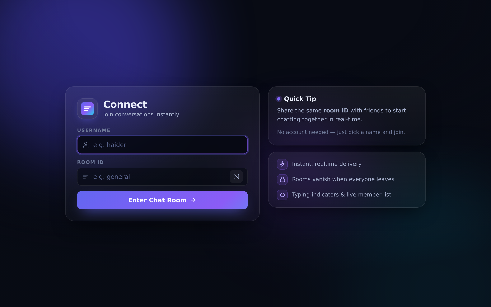
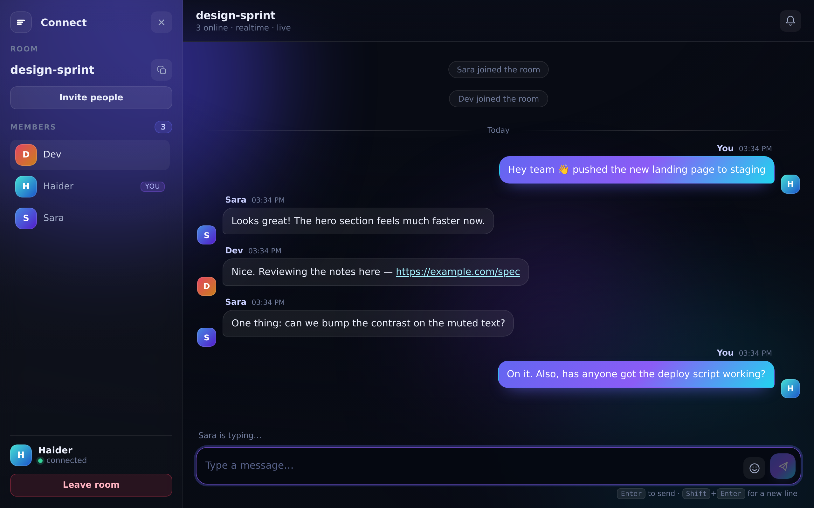
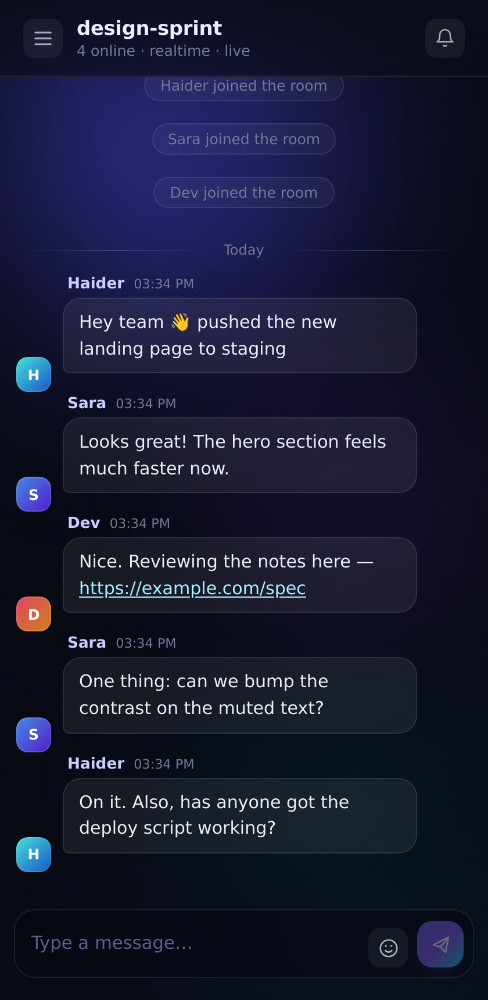

# Connect 💬

A realtime, room-based chat app. Pick a username and a room ID, share the room ID with
friends, and chat instantly — **no accounts, no database, no build step, and no
dependencies.**

```bash
node server.js          # needs Node 18+ ... that's it
# open http://localhost:3000
```



---

## Features

**Chat**
- Instant delivery over WebSockets, with automatic reconnection
- **HTTP long-poll fallback** — if a proxy or network blocks WebSocket upgrades, the
  client transparently switches to polling and keeps working ("basic mode" in the header)
- Rooms are isolated and ephemeral: a room exists only while someone is inside
- Message history (last 150) replayed for people who join late
- Live member list with typing indicators
- Auto-linked URLs, emoji picker, grouping of consecutive messages, day separators
- Notification sound (mutable), unread counter in the tab title, jump-to-latest button
- Invite links: `https://your-host/?room=design-sprint` prefills the room, with a
  copy-friendly fallback panel for browsers/embeds where the clipboard API is blocked
- Your name and last room are remembered locally between visits

**Engineering**
- Server-side validation, 2 000-char cap, per-user rate limiting ("Whoa — slow down")
- Case-insensitive unique names per room, with reconnect takeover so a dropped
  connection never locks you out of your own name
- All message text is rendered as **text**, never HTML — XSS-safe by construction
- Static file server with path-traversal protection
- Heartbeat pings reap dead connections; empty rooms are garbage-collected
- Responsive down to phone width (slide-in member drawer)

| Chat | Mobile |
| --- | --- |
|  |  |

---

## Project layout

```
connect/
├── server.js              HTTP + WebSocket + polling API, room state, validation
├── lib/ws-lite.js         dependency-free RFC 6455 WebSocket server
├── public/
│   ├── index.html         join screen + chat screen markup
│   ├── styles.css         full design system, responsive, reduced-motion friendly
│   └── app.js             client: transports, rendering, typing, reconnect logic
├── test/
│   ├── e2e.js             33 backend assertions (no dependencies)
│   ├── ui.js              37 browser-client assertions (needs jsdom, see below)
│   └── ws-client-lite.js  minimal WebSocket client used by the tests
├── deploy/
│   ├── tunnel.sh          publish your local server on a public https URL
│   ├── connect.service    systemd unit
│   └── nginx.conf         reverse-proxy config with WebSocket upgrade headers
├── Dockerfile · docker-compose.yml · fly.toml · render.yaml
├── DEPLOY.md              how to deploy + "how do I become the server?"
└── screenshots/
```

### Why the WebSocket server is hand-rolled

`lib/ws-lite.js` implements the parts of RFC 6455 this app needs (text frames,
fragmentation, ping/pong, close handshake, masking enforcement, payload cap) in ~200
lines. That keeps `npm install` out of the picture entirely, which is handy for
dropping the app onto a small VPS or a Raspberry Pi. If you prefer the battle-tested
library, `npm i ws` and swap the import at the top of `server.js` for
`const { WebSocketServer } = require('ws')` — the rest of the code is unaffected.

---

## Transport design

The client always tries a WebSocket first and sends a `join` immediately on open. If the
upgrade never completes, or the socket keeps dropping, it falls back to
`POST /api/join` + `GET /api/poll?id=…&after=…`, which returns the same event objects
the socket would have pushed. Both transports share one session model, so a reconnect —
even across transports — resumes with the same identity via the `resume` token.

```
browser ──ws──▶  {type:"join"}   ──▶ server: hello → joined(history, users)
                 {type:"message"}              message / users / typing broadcasts
                 {type:"typing"}
                                     fallback: POST /api/{join,message,typing,leave}
                                               GET  /api/poll?id=..&after=..
```

Messages are de-duplicated client-side by message id, so replayed history and replays
after a reconnect can never double-post.

### HTTP endpoints

| Method | Path | Purpose |
| --- | --- | --- |
| `GET` | `/health` | `{ ok, rooms, online, uptime }` — useful for uptime checks |
| `POST` | `/api/join` | `{ name, room, resume? }` → `{ ok, sessionId }` |
| `GET` | `/api/poll` | `?id=…&after=n` → `{ ok, events[], seq }` |
| `POST` | `/api/message` | `{ id, text }` |
| `POST` | `/api/typing` | `{ id, on }` |
| `POST` | `/api/leave` | `{ id }` |

---

## Tests

```bash
npm start                 # terminal 1
node test/e2e.js          # terminal 2 — 33 backend assertions, zero dependencies

npm i --no-save jsdom     # optional: drives the real page in a simulated DOM
node test/ui.js           # 37 client assertions (chat, typing, invite, XSS, sandbox, ...)
```

The suite covers the WebSocket flow, the polling fallback, reconnect takeover, history
replay, room isolation and garbage collection, rate limiting, duplicate-name rules,
path traversal, and XSS-safe rendering. The WebSocket implementation has also been
verified against Chrome's WebSocket client and jsdom's — i.e. real, third-party
protocol implementations, not just my own client.

---

## Deploying

**Full walkthrough: [DEPLOY.md](DEPLOY.md).** The short version — you run one process and
share a URL; your friends are clients:

```bash
./deploy/tunnel.sh      # public https://…trycloudflare.com URL in ~2 minutes, no account
# or
node server.js          # just LAN access on http://<your-ip>:3000
# or
docker compose up -d    # your own box / server
```

Configs for nginx + systemd, Fly.io, Render and Docker are included in `deploy/` and the
repo root. For nginx in front, remember the upgrade headers — without them the app still
works, but silently drops to polling:

```nginx
location / {
    proxy_pass         http://127.0.0.1:3000;
    proxy_http_version 1.1;
    proxy_set_header   Upgrade    $http_upgrade;
    proxy_set_header   Connection "upgrade";
    proxy_set_header   Host       $host;
    proxy_read_timeout 3600s;      # keep idle sockets alive
}
```

systemd unit:

```ini
[Unit]
Description=Connect chat
After=network.target

[Service]
WorkingDirectory=/opt/connect
ExecStart=/usr/bin/node server.js
Environment=PORT=3000
Restart=always
User=connect

[Install]
WantedBy=multi-user.target
```

Environment variables: `PORT` (default `3000`), `HOST` (default `0.0.0.0`).

---

## Known limits

- **In-memory state.** Restarting the server clears rooms and history. To persist, write
  `room.history` to SQLite/Redis inside `sendMessage()` in `server.js`.
- **No moderation or auth.** Anyone with a room ID can join — that's the intended
  "share a link and chat" model. Add a room secret or a password check in `join()` if you
  need gating.
- **Leaving takes two clicks** ("Confirm leave?") because `window.confirm()` is a no-op
  inside sandboxed iframes; same reason `localStorage` and `history` access are wrapped in
  try/catch.
- **Rooms cap at 500 concurrent** and messages at 12 per 6 seconds per user; both are
  constants at the top of `server.js`.

## Configuration quick reference

`server.js` (top of file): `HISTORY_LIMIT`, `MAX_TEXT`, `MAX_NAME`, `MAX_ROOM`,
`MAX_ROOMS`, `RATE_WINDOW`, `RATE_MAX`.

`public/app.js`: `GROUP_WINDOW` (message grouping), `EMOJIS` (picker contents).

MIT licensed — do whatever you like with it. Deployment guide: [DEPLOY.md](DEPLOY.md).
